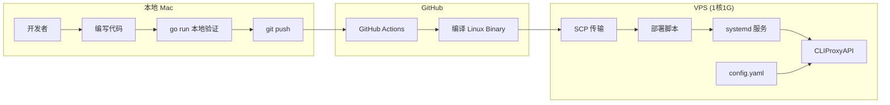

# Design Document

## Overview

本设计提供一套轻量级的 CI/CD 方案，让开发者可以在本地 Mac 上开发，push 代码后通过 GitHub Actions 自动编译 Go 二进制文件并部署到低配 VPS。方案避免使用 Docker，直接运行编译后的二进制文件，配合 systemd 进行服务管理。

## Architecture



## Components and Interfaces

### 1. GitHub Actions Workflow (`deploy.yml`)

负责自动化构建和部署流程：

- **触发条件**: push 到 main 分支
- **构建步骤**: 
  - checkout 代码
  - 设置 Go 环境
  - 编译 Linux amd64 二进制
- **部署步骤**:
  - 通过 SSH 连接 VPS
  - 上传二进制文件
  - 执行部署脚本

### 2. Systemd Service Unit (`cliproxy.service`)

管理应用生命周期：

- **服务类型**: simple
- **自动重启**: on-failure，延迟 5 秒
- **工作目录**: `/opt/cliproxy`
- **运行用户**: 专用 cliproxy 用户

### 3. 部署脚本 (`deploy.sh`)

VPS 上的部署脚本：

- 停止现有服务
- 备份旧二进制
- 替换新二进制
- 重启服务
- 验证启动状态

## Data Models

### GitHub Secrets 配置

| Secret 名称 | 说明 |
|------------|------|
| `VPS_HOST` | VPS IP 地址或域名 |
| `VPS_USER` | SSH 登录用户名 |
| `VPS_SSH_KEY` | SSH 私钥内容 |
| `VPS_PORT` | SSH 端口（默认 22） |

### VPS 目录结构

```
/opt/cliproxy/
├── CLIProxyAPI            # 可执行文件
├── CLIProxyAPI.bak        # 备份文件
├── config.yaml            # 配置文件（从 Docker 迁移保留）
├── deploy.sh              # 部署脚本
├── logs/                  # 日志目录
└── auths/                 # 认证文件目录（原 Docker 的 ./auths）
```

### 端口配置

服务直接监听以下端口（与 Docker 配置一致）：
- 8317: 主 API 端口
- 8085, 1455, 54545, 51121, 11451: 其他服务端口

### 环境变量

| 变量名 | 说明 |
|-------|------|
| `HOME` | 设置为 `/opt/cliproxy`，使 auth-dir `~/.cli-proxy-api` 指向 `/opt/cliproxy/auths` |
| `TZ` | 时区，设置为 `Asia/Shanghai` |


## Correctness Properties

*A property is a characteristic or behavior that should hold true across all valid executions of a system-essentially, a formal statement about what the system should do. Properties serve as the bridge between human-readable specifications and machine-verifiable correctness guarantees.*

由于本功能主要是 CI/CD 配置文件和脚本，大部分验证依赖外部系统（GitHub Actions、VPS、systemd），因此可测试的属性有限。以下是可以通过静态检查验证的属性：

### Property 1: Workflow 触发配置正确性
*For any* GitHub Actions workflow 文件，当配置了 `on.push.branches: [main]` 时，该 workflow 应该在 main 分支 push 时被触发。
**Validates: Requirements 1.1**

### Property 2: Systemd 自动重启配置正确性
*For any* systemd service 文件，当配置了 `Restart=on-failure` 和 `RestartSec=5` 时，服务崩溃后应在 5 秒内重启。
**Validates: Requirements 2.2**

### Property 3: 部署脚本配置保留
*For any* 部署脚本执行，如果 config.yaml 已存在，则不应被覆盖；如果不存在，则应从 config.example.yaml 复制。
**Validates: Requirements 5.1, 5.2**

## Error Handling

### GitHub Actions 错误处理

1. **编译失败**: workflow 终止，显示编译错误日志
2. **SSH 连接失败**: workflow 终止，提示检查 secrets 配置
3. **部署脚本失败**: workflow 终止，显示脚本错误输出

### VPS 端错误处理

1. **服务启动失败**: systemd 记录日志到 journal，可通过 `journalctl -u cliproxy` 查看
2. **服务崩溃**: systemd 自动重启，最多重试 5 次后停止
3. **配置文件错误**: 应用启动时报错，记录到日志

## Testing Strategy

### 静态验证

由于本功能主要是配置文件，采用以下验证方式：

1. **YAML 语法检查**: 验证 workflow 和 service 文件语法正确
2. **配置完整性检查**: 验证必要的配置项都已设置
3. **脚本语法检查**: 使用 `shellcheck` 验证 bash 脚本

### 手动验证

1. **本地构建测试**: 在本地运行 `go build` 验证编译
2. **首次部署测试**: 手动触发 workflow 验证完整流程
3. **服务管理测试**: 在 VPS 上测试 systemctl 命令